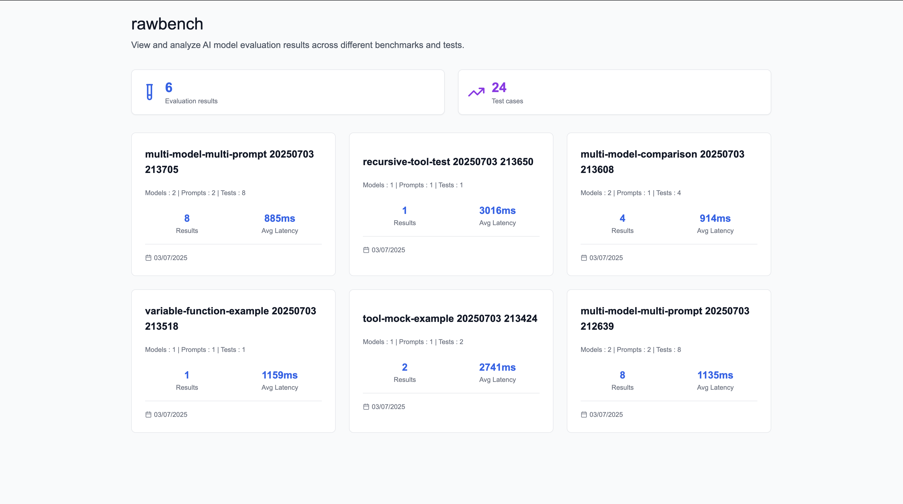
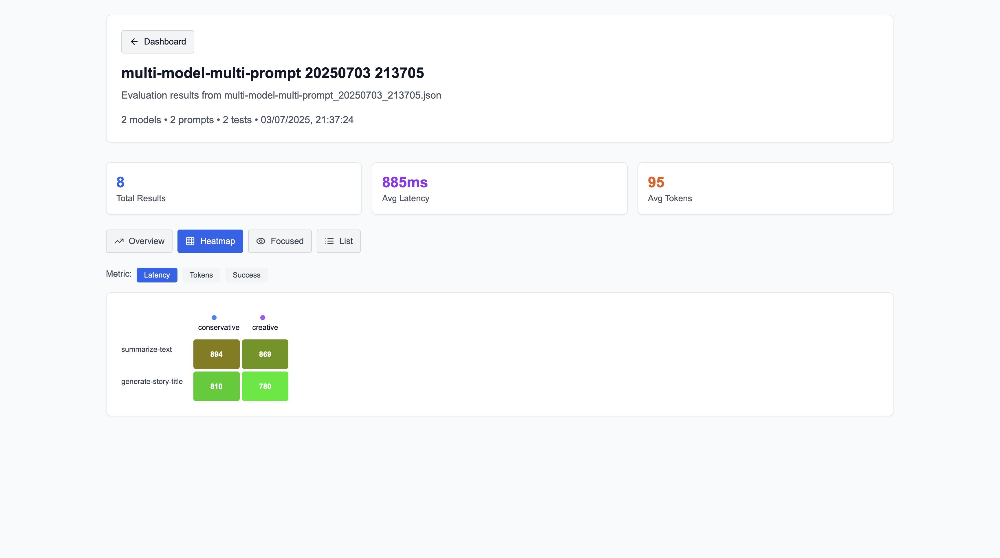
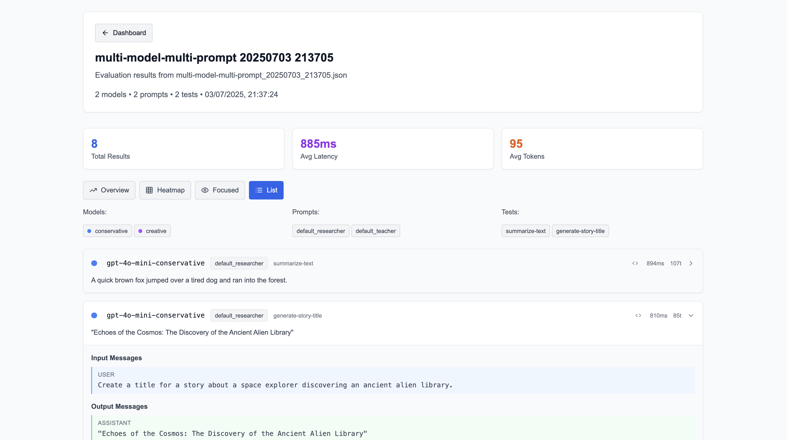
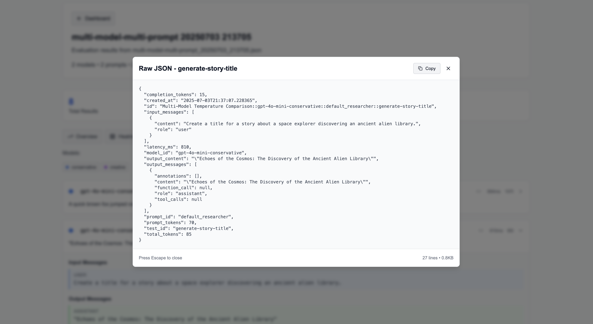

# RawBench Prompt Evaluation

Powerful, minimal framework for LLM prompt evaluation with YAML configuration, tool execution support, and comprehensive result tracking.

[](https://python.org)
[](LICENSE)

## Why RawBench?

Most prompt testing tools are either too academic or too bloated.

**RawBench is for devs who want:**

- YAML-first, CLI-native minimal workflow
- Built in tool call mocking with recursive support
- Dynamic variables (functions, env, time, etc.)
- Multi-model testing with latency + cost metrics
- Zero setup, just run `rawbench init && rawbench run`

---





## Features

### Live

- Multi-model testing with simultaneous evaluation
- YAML configuration with Docker-compose style anchors
- Variable substitution and template system
- Metrics for latency, tokens, and costs
- CLI and Python API interfaces
- **Extensible tool mocking system**
- Dynamic variable injection
- Beautiful html reports
- **Local dashboard for interactive result viewing**

### roadmap

- assertions
- response caching
- ai judge
- prompt auto-finetuning
- more llm providers
- ...

## Quickstart


**Setup**
```bash
git clone https://github.com/0xsomesh/rawbench.git
cd rawbench
make install

# initiate rawbench
rawbench init rawbench_tests
cd rawbench_tests
```

Enter the api keys of inference provides in `.env`. rawbench uses [litellm](https://github.com/BerriAI/litellm) to interact with the providers. Here is a list of all the [providers supported on rawbench](https://github.com/BerriAI/litellm?tab=readme-ov-file#supported-providers-docs).


```bash
# Run evaluation
rawbench run tests/template.yaml --html -o template_result

# Start local dashboard server
rawbench serve --port 8000
```

## Dashboard

RawBench now includes a local React dashboard for interactive result viewing:

- **Interactive Results Viewer**: Browse and analyze evaluation results with a modern web interface
- **Real-time Updates**: View results as they're generated
- **Detailed Metrics**: Explore latency, token usage, and cost breakdowns
- **Test Case Analysis**: Drill down into individual test cases and responses
- **Model Comparison**: Compare performance across different models side-by-side

To start the dashboard:
```bash
rawbench serve --port 8000
```

Then open your browser to `http://localhost:8000` to access the dashboard.


---

---



## Configuration

RawBench uses YAML files for configuration. Here's a comprehensive guide to the configuration options:

### Basics

```yaml
id: evaluation-name
description: Optional description of the evaluation

models:
  - id: model-id
    provider: openai
    name: gpt-4
    temperature: 0.7
    max_tokens: 1024

prompts:
  - id: prompt-id
    system: |
      System prompt text here

tests:
  - id: test-id
    messages:
      - role: user
        content: Test message content
```

### Tool Mocking

RawBench supports powerful tool mocking for testing agents that use function calling:
- **Recursive**: Handles multiple tool calls in sequence
- **Priority Resolution**: Test-specific mocks override global mocks
- **Loop Prevention**: `max_iterations` prevents infinite loops
- **Clean**: Simple YAML structure

```yaml
tools:
  - id: search_tool
    name: search_tool
    description: Search for information
    parameters:
      type: object
      properties:
        query:
          type: string
          description: Search query
      required: [query]
    mock:
      output: '{"results": [{"title": "Example", "content": "Search result"}]}'

tests:
  - id: search-test
    tool_execution:
      mode: mock                    # mock or actual
      max_iterations: 5             # Prevent infinite loops
      output:                       # Test-specific mocks (overrides global)
        - id: search_tool
          output: '{"results": [{"title": "Custom", "content": "Custom result"}]}'
    messages:
      - role: user
        content: "Search for information about AI"
```

### Models

You can compare multiple models or different configurations of the same model:

```yaml
models:
  - id: gpt4-conservative
    provider: openai
    name: gpt-4
    temperature: 0.2

  - id: gpt4-creative
    provider: openai
    name: gpt-4
    temperature: 0.8
```

### Prompts

You can compare multiple prompts:

```yaml
prompts:
- id: default_researcher
  system: |
    You are a helpful crypto research assistant.

- id: default_teacher
  system: |
    You are a knowledgeable teacher.
```

### Variables and Dynamic Content

RawBench supports dynamic variables in your prompts:

```yaml
variables:
  - id: current_time
    function: current_datetime  # Loads from variables/current_datetime.py

prompts:
  - id: time_aware_prompt
    system: |
      Current time is {{current_time}}
      Please consider this timestamp in your responses.
```

Note: You'll have to create a new file `current_time` and define a function `current_time` returning the string

### Example Configurations

1. **Multi-Model Comparison**
   - Location: `examples/evaluations/multi-model-comparison.yaml`
   - Compare responses from different models or configurations
   - Track performance metrics across models

2. **Complex Evaluation Criteria**
   - Location: `examples/evaluations/complex-criteria.yaml`
   - Define sophisticated evaluation rules
   - Apply multiple test cases

3. **Variable Usage**
   - Location: `examples/evaluations/variable-usage.yaml`
   - Inject dynamic content into prompts
   - Use environment variables and functions

4. **Tool Mocking**
   - Location: `examples/evaluations/tool-mock-example.yaml`
   - Mock external tool calls
   - Test tool-using agents

5. **Recursive Tool Testing**
   - Location: `examples/evaluations/recursive-tool-test.yaml`
   - Test agents that make multiple tool calls
   - Complex workflow testing

## Requirements

- Python ≥ 3.8

## License

MIT