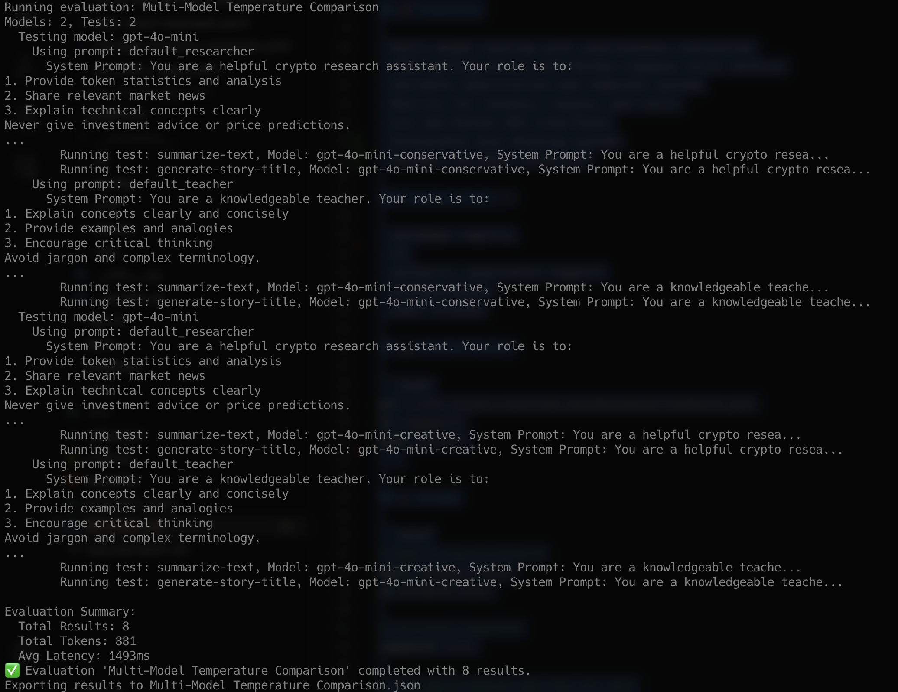

# RawBench Prompt Evaluation

Powerful, minimal framework for LLM prompt evaluation with YAML configuration, tool execution support, and comprehensive result tracking.

[](https://python.org)
[](LICENSE)

## ⚡️ Why RawBench?

Most prompt testing tools are either too academic or too bloated.

**RawBench is for devs who want:**

- 🧱 YAML-first, CLI-native workflow (like `docker-compose` for prompts)
- ⚙️ Built in tool call mocking
- 🧠 Dynamic variables (functions, env, time, etc.)
- 🧪 Multi-model testing with latency + cost metrics
- 🧼 Zero setup, just run `rawbench init && rawbench run`

---





## 🚀 Features

- Multi-model testing with simultaneous evaluation
- YAML configuration with Docker-compose style anchors
- Variable substitution and template system
- Metrics for latency, tokens, and costs
- CLI and Python API interfaces
- Extensible tool mocking system
- Dynamic variable injection

### Coming soon 🔜

- markdown reports
- UI
- anthoric, openrouter support
- documentation
- pypi release

## 💻 Installation

```bash
git clone https://github.com/0xsomesh/rawbench.git
cd rawbench
make install
```

## 🧹 Usage

```bash
# make a new directory
mkdir prompts-eval
cd prompts-eval

# initiate rawbench
rawbench init

# export openai api key
EXPORT OPENAI_API_KEY="<your_key_here>"

# Run evaluation
rawbench run evaluations/template.yaml
```

## 📝 Configuration Guide

RawBench uses YAML files for configuration. Here's a comprehensive guide to the configuration options:

### Basic Structure

```yaml
id: evaluation-name
description: Optional description of the evaluation

models:
  - id: model-id
    provider: openai
    name: gpt-4
    temperature: 0.7
    max_tokens: 1024

prompts:
  - id: prompt-id
    system: |
      System prompt text here

tests:
  - id: test-id
    messages:
      - role: user
        content: Test message content
```

### Multiple Models

You can compare multiple models or different configurations of the same model:

```yaml
models:
  - id: gpt4-conservative
    provider: openai
    name: gpt-4
    temperature: 0.2

  - id: gpt4-creative
    provider: openai
    name: gpt-4
    temperature: 0.8
```

### Variables and Dynamic Content

RawBench supports dynamic variables in your prompts:

```yaml
variables:
  current_time:
    function: current_datetime  # Loads from variables/current_datetime.py

prompts:
  - id: time_aware_prompt
    system: |
      Current time is {{current_time}}
      Please consider this timestamp in your responses.
```

### Example Configurations

1. **Multi-Model Comparison**
   - Location: `examples/evaluations/multi-model-comparison.yaml`
   - Compare responses from different models or configurations
   - Track performance metrics across models

2. **Complex Evaluation Criteria**
   - Location: `examples/evaluations/complex-criteria.yaml`
   - Define sophisticated evaluation rules
   - Apply multiple test cases

3. **Variable Usage**
   - Location: `examples/evaluations/variable-usage.yaml`
   - Inject dynamic content into prompts
   - Use environment variables and functions

4. **Tool Mocking**
   - Location: `examples/evaluations/tool-mock-example.yaml`
   - Mock external tool calls
   - Test tool-using agents

## 🔖 Requirements

- Python ≥ 3.8

## 🪪 License

MIT

## 📚 Examples

Check the `examples/evaluations/` directory for more sample configurations:

- `multi-model-comparison.yaml`: Compare different models and parameters
- `format-tests.yaml`: Test response formatting
- `variable-function-example.yaml`: Dynamic variable injection
- `tool-mock-example.yaml`: Tool mocking examples
- `complex-criteria.yaml`: Advanced evaluation criteria